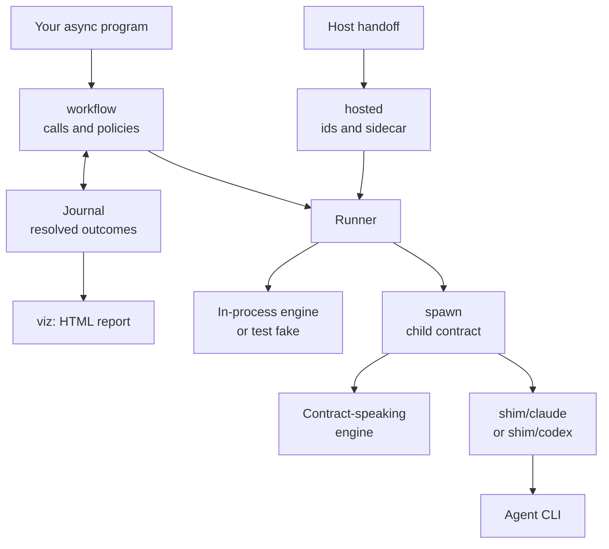
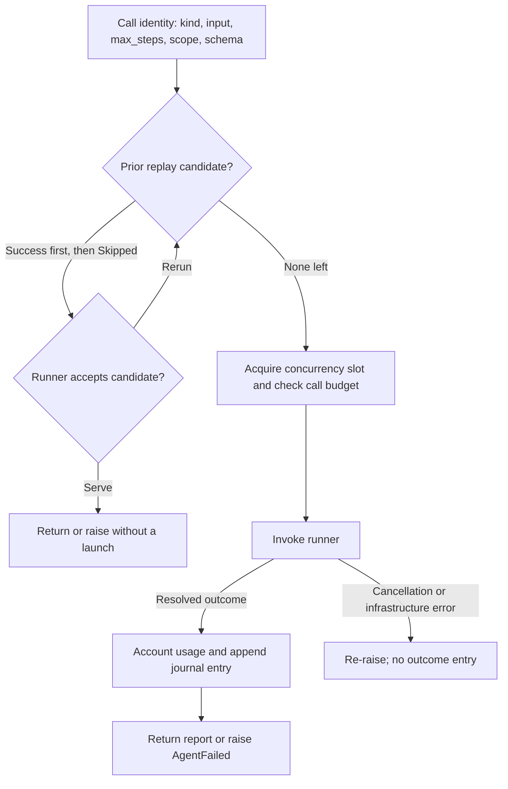

# moonbitlang/workflow

Write a multi-agent workflow as an ordinary async MoonBit program. Share
concurrency and call limits across its agents, choose how failures affect
each stage, and resume completed work from a journal. The program's loops
and branches determine what runs; there is no separate graph to declare.

The core package never spawns anything. Its one seam is `Runner`: a
single async function from `AgentCall` to `AgentOutcome`. Engines plug
in from the outside — through the `spawn` sub-package's child-contract
implementation for out-of-process engines, or any in-process function;
tests plug in fakes, which is why everything below runs hermetically.

## Setup and package map

Add the module to a consuming project:

```sh
moon add moonbitlang/workflow
```

Import the packages you use in that project's `moon.pkg`. For the examples
below, which also use the async runtime:

```moonbit nocheck
import {
  "moonbitlang/workflow",
  "moonbitlang/async",
}

supported_targets = "native+wasm"
```

Run with `moon run --target native <package>` or `--target wasm`. Every
package in this module supports these two targets. Blocks marked `mbt check`
in these READMEs are compiled and run by `moon test`; shell commands and
`nocheck` snippets are usage instructions, not automatic agent launches.

| Package | Use it for |
| --- | --- |
| [`workflow`](README.mbt.md) | Calls, typed outcomes, concurrency, retries, replay, and accounting. |
| [`workflow/spawn`](spawn/README.mbt.md) | Running a process that speaks the child contract. |
| [`workflow/hosted`](hosted/README.mbt.md) | Running under a host that supplies child ids, launch limits, and journal paths. |
| [`workflow/shim`](shim/README.mbt.md) | Building adapters from a foreign CLI's output to the child contract. |
| [`workflow/shim/claude`](shim/claude/README.mbt.md) | Executable adapter for Claude Code. |
| [`workflow/shim/codex`](shim/codex/README.mbt.md) | Executable adapter for Codex. |
| [`workflow/viz`](viz/README.mbt.md) | Rendering a journal as a standalone HTML report. |
| [`workflow/examples/scout`](examples/scout/README.mbt.md) | A small executable demonstrating process calls and journal replay. |



The arrows show runtime handoffs, not package imports. `hosted` and `spawn`
depend on the core; the core has no dependency on a particular engine.

## Calls and limits

Construct `Workflow(runner=...)` once and share it across concurrent tasks.

| Setting or method | Meaning |
| --- | --- |
| `max_concurrent` | Maximum simultaneous runner invocations; default 8, minimum 1. |
| `max_calls` | Maximum live runner invocations in this workflow; omitted means unlimited, 0 allows replay only. |
| `replay_scope` | Extra identity string, default empty. Set it when work depends on a repository revision or configuration absent from the input. |
| `agent(prompt~, kind~)` | Sends `{query, hints?}`; the label defaults to a shortened prompt. |
| `agent_call(kind~, input~, label~)` | Sends the exact JSON shape a kind requires. |
| `agent_as[T : FromJson](...)` | Calls `agent`, then decodes the complete report as `T`. |
| `calls_made()` / `calls_replayed()` | Live runner invocations / outcomes served from prior journal entries. |
| `tokens_spent()` / `cost_usd()` | Usage from resolved live outcomes in this run. Historical replay usage is excluded. |

The call allowance counts entry into the runner, even if it refuses work or
cannot spawn a process. Queue cancellation and replay consume no allowance.
`max_steps` and `schema` are requests to the runner; the core does not enforce
an engine's step limit or JSON Schema. `agent_as` independently decodes the
returned value. There is no core token budget or wall deadline; process
deadlines belong to `spawn` and `hosted`.

## The failure model

Everything else follows from three decisions:

- **Failure is data, in a typed channel.** An agent that produced no
  usable report raises `WorkflowError::AgentFailed` with a typed
  `AgentFailure` cause; `attempt` folds it into a `Result` for fan-out
  sites. A failure is never a silent `null`: it either raises
  `AgentFailed` or lands in `attempt`'s `Result`.
- **Resolved failures retain their usage.** `AgentOutcome` carries the attempt's spend on
  BOTH arms — a timed-out child's tokens land in `tokens_spent()` just
  like a success's. `attempt=None` means no launch was ever tried.
  Engines that price their work report it too: `cost_usd()` sums their
  figures, and stays a floor when an engine in the mix prices nothing.
- **Cancellation propagates.** Engine bugs and cancellation `raise`
  through and cancel the task group. They do not produce a journalled
  outcome. Usage from an interrupted call is not added to the core counters;
  adapters that need it during teardown can use `spawn.ContractProgress`.

## A workflow, end to end

One phase fans three verifiers out over a finding, a quorum policy
requires at least 2 of the 3 CALLS to succeed (agreement between the
returned verdicts is then the script's own judgment, as the filter below
shows), and every launch is capped by the shared semaphore:

```mbt check
///|
async fn verdict_runner(call : @workflow.AgentCall) -> @workflow.AgentOutcome {
  @async.pause()
  let verdict : Json = if call.input is { "query": String(q), .. } &&
    q.contains("lens=repro") {
    { "confirmed": false }
  } else {
    { "confirmed": true }
  }
  Finished(
    value=verdict,
    attempt=@workflow.AgentAttempt(
      attempt_id="sr-\{call.label}",
      steps_used=3,
      prompt_tokens=70,
      completion_tokens=30,
    ),
  )
}

///|
async test "fan out three lenses, gate on a 2-of-3 quorum" {
  let wf = @workflow.Workflow(
    runner=@workflow.Runner(verdict_runner),
    max_concurrent=4,
    max_calls=16,
  )
  wf.phase("Verify")
  let results = @workflow.fan_out(["correctness", "security", "repro"], lens => {
    @workflow.attempt(() => {
      wf.agent(
        kind="judge",
        prompt="Judge the finding through lens=\{lens}: real?",
        label="verify:\{lens}",
      )
    })
  })
  let confirmed = @workflow.quorum(results, need=2)
    .filter(v => v is { "confirmed": True, .. })
    .length()
  assert_eq(confirmed, 2)
  assert_eq(wf.calls_made(), 3)
  assert_eq(wf.tokens_spent(), 300)
}
```

`fan_out` gives every item its own `Result` slot — one lost verifier
never poisons its siblings, and the tokens they spent stay spent. When
later work is worthless without ALL of a stage, use `parallel_all`
instead: the first failure cancels every sibling still in flight. The
policies are one identifier each: `all_ok`, `collect_ok(min_ok?)`,
`quorum(need~)`. Both fan-outs are one task group: a raise inside one
cancels the rest and unwinds the whole stage, so nothing outlives it.

| Policy | When to use it |
| --- | --- |
| `parallel` / `fan_out` with `attempt` | Keep a `Result` for each input, in input order. Typed workflow failures stay in their own slots. |
| `parallel_all` | Every branch is required; a raise cancels siblings still running. |
| `all_ok` | Require all already-collected results to succeed; raises the first error in array order. |
| `collect_ok(min_ok=0)` | Keep successes, optionally requiring a minimum count. |
| `quorum(need~)` | Require a count of successful calls; it does not compare answers for agreement. |

`all_ok`, `collect_ok`, and `quorum` inspect completed results; they do not
cancel work early. `attempt` captures only `WorkflowError`, including
`AgentFailed`, `CallBudgetExhausted`, and `QuorumNotReached`.

A model that answered off-schema or ran out of steps can be worth asking
again. `retry` wraps a raising step with `max_retry` extra attempts (default
1), spaced by `backoff` (default `Immediate`). Its default `worth_retrying`
policy retries `AgentFailed` except `Skipped`; it does not retry a spent
call budget or unmet quorum. A custom `retriable` callback can change that
typed-error policy. Engine bugs and cancellation always propagate.

Put `attempt` around `retry`, rather than passing `retry` a step that already
returns `Result`. Each live retry uses a slot and call allowance, and its
resolved outcome is journalled. On resume, an earlier successful report can
be replayed:

```mbt check
///|
async test "retry until the engine actually answers" {
  let flaky : Ref[Int] = { val: 0, }
  let wf = @workflow.Workflow(
    runner=@workflow.Runner(call => {
      @async.pause()
      flaky.val += 1
      if flaky.val < 3 {
        DidNotFinish(failure=NoReport, attempt=None)
      } else {
        Finished(
          value={ "attempt": flaky.val },
          attempt=@workflow.AgentAttempt(
            attempt_id="sr-\{call.label}",
            steps_used=1,
            prompt_tokens=40,
            completion_tokens=10,
          ),
        )
      }
    }),
  )
  let report = @workflow.retry(
    () => wf.agent(prompt="Name the worst bug in spawn/", kind="judge"),
    max_retry=2,
  )
  assert_eq(report, { "attempt": 3 })
  assert_eq(wf.calls_made(), 3)
}
```

`agent` builds the explore input shape — `{query, hints?}` — because that
is what most calls are. A kind with its own shape (the contract's
`review` and `worker`) goes through `agent_call`, which sends the exact
JSON it is given; that input IS the replay identity, so an engine
encoding its own kinds gets replay for free. `attempt` folds the typed
error channel around ANY raising step, so those calls reach a fan-out
without a `try_` twin per entry point:

```mbt check
///|
async fn slice_runner(call : @workflow.AgentCall) -> @workflow.AgentOutcome {
  @async.pause()
  guard call.input is { "task": String(task), .. } else {
    return DidNotFinish(failure=Failed("not a worker input"), attempt=None)
  }
  Finished(
    value={ "status": "done", "task": task },
    attempt=@workflow.AgentAttempt(
      attempt_id="sr-\{call.label}",
      steps_used=1,
      prompt_tokens=10,
      completion_tokens=5,
    ),
  )
}

///|
async test "fan a worker kind out through its own input shape" {
  let wf = @workflow.Workflow(runner=@workflow.Runner(slice_runner))
  let slices = ["rename the seam", "widen the ceiling"]
  let done = @workflow.fan_out(slices, task => {
    @workflow.attempt(() => {
      wf.agent_call(
        kind="worker",
        input={ "task": task, "worker_root": "/w" },
        label="worker:\{task}",
      )
    })
  })
  assert_eq(@workflow.all_ok(done).length(), 2)
}
```

When the script wants a TYPE rather than JSON, decode at the boundary:
`agent_as` runs the same call and turns a report that does not satisfy
the type into a typed `AgentFailed(Failed("report rejected: …"))` carrying
the decoder's path. A `schema` rides the request envelope so an engine
that can constrain its model to the shape does (the Claude and Codex
shims do); decoding still runs, because the engine is not trusted to
validate, and the schema is part of the call's replay identity:

```mbt check
///|
struct Confirmation {
  confirmed : Bool
} derive(FromJson)

///|
async test "decode the report at the boundary" {
  let wf = @workflow.Workflow(runner=@workflow.Runner(verdict_runner))
  let verdict : Confirmation = wf.agent_as(
    prompt="Judge the finding through lens=security: real?",
    kind="judge",
    schema={
      "type": "object",
      "properties": { "confirmed": { "type": "boolean" } },
      "required": ["confirmed"],
    },
  )
  assert_true(verdict.confirmed)
}
```

Multi-stage pipelines are just function composition inside the fan-out —
stages need no barrier between them, so composing them per-item IS the
pipeline:

```mbt check
///|
async test "find then verify, with no barrier between the stages" {
  let wf = @workflow.Workflow(runner=@workflow.Runner(verdict_runner))
  let verified = @workflow.fan_out(["pkg/a", "pkg/b"], target => {
    let finding = @workflow.attempt(() => {
      wf.agent(prompt="Find the worst bug in \{target}", kind="judge")
    })
    match finding {
      // Each finding proceeds to verification the moment ITS finder
      // returns — b's finder may still be running while a verifies.
      Ok(_) =>
        @workflow.attempt(() => {
          wf.agent(
            prompt="Adversarially verify the finding in \{target}",
            kind="judge",
          )
        })
      Err(error) => Err(error)
    }
  })
  assert_eq(@workflow.all_ok(verified).length(), 2)
}
```

## Replay: crash, resume, and pay only for new work

Every live outcome is appended to the `Journal` — the call's WORK
identity (kind, input, max_steps, scope, schema — never the display label) plus
the lossless outcome, plus attribution for readers: the phase the call
was issued under and the wall-clock window it ran in, as milliseconds
since the epoch. Attribution never takes part in replay matching.
Re-running the same program against the same journal
replays successes for free, keeps a human's `Skipped` refusal standing,
and re-attempts other failures — getting past those is what resume is
for:

```mbt check
///|
async test "the second generation replays instead of re-paying" {
  let journal = @workflow.Journal::in_memory()
  let wf1 = @workflow.Workflow(
    runner=@workflow.Runner(verdict_runner),
    journal~,
  )
  let first = wf1.agent(
    prompt="Judge the finding through lens=security: real?",
    kind="judge",
  )
  assert_eq(wf1.tokens_spent(), 100)

  // Same program, next generation: served from the journal — no launch,
  // no slot, no fresh spend.
  let wf2 = @workflow.Workflow(
    runner=@workflow.Runner(verdict_runner),
    journal=@workflow.Journal::in_memory(prior=journal.recorded()),
  )
  assert_eq(
    wf2.agent(
      prompt="Judge the finding through lens=security: real?",
      kind="judge",
    ),
    first,
  )
  assert_eq(wf2.calls_made(), 0)
  assert_eq(wf2.calls_replayed(), 1)
  assert_eq(wf2.tokens_spent(), 0)
}
```

File-backed journals (`@workflow.Journal::load(path)`) are append-only JSONL,
accumulated across generations. A malformed final line is dropped and the
file repaired; corruption anywhere else raises `JournalCorrupted`. Repair
preserves the healthy bytes without re-encoding them. Identical concurrent
calls are treated as intentional samples, such as three identical
verifiers, and consume separate prior entries.



Replay is from prior entries only: two identical calls in the same live run
still execute twice. Among matching prior entries, successes are considered
in file order before recorded `Skipped` refusals. Other failures are not
replay candidates. Labels, phases, and timestamps do not affect identity.

Use one writing workflow process per journal path. Appends are serialized
within a journal instance, not across processes. `Journal::load` is suitable
for resuming a stopped writer, not watching an active one; use
[`viz`](viz/README.mbt.md) for a reader that never repairs the source file.
A complete final entry missing only its newline is retained and the newline
is restored. A malformed tail is removed. Each stored entry has the
versioned envelope `{"v":1,"e":...}`. `prior()` and `recorded()` return copies
of the loaded entries and this instance's new outcomes respectively.

`agent_as` decodes after the raw report has been recorded. If decoding fails,
the journal still holds a `Finished` raw report, and resume can reproduce
the same decode error. Change the input, schema, or scope when the task's
meaning changes, or reject an unsuitable candidate in `validate_replay`.
The journal does not make arbitrary side effects exactly once: a process
can finish work and crash before its outcome is durably recorded.

A v1 line that carries no entry is metadata: replay skips it and repair
preserves it, so a tool can annotate a journal, and a declared plan has a
place to live when one arrives. Labels follow the convention
`stage:instance` (`verify:claude:3`, `survey:journal`): readers group the
instances of one stage by the prefix before the first colon.

## Observability

`@workflow.Workflow(on_event=...)` narrates the run: `PhaseStarted`, `Log`, and an
`AgentStarted`/`AgentFinished` bracket that balances on EVERY path —
success, typed failure, cancellation (`Interrupted`), and infrastructure
error (`Errored`) — plus `AgentReplayed` for journal hits. Purely
observational: no control flow rides on events.

## Plugging in an engine

A `Runner` wraps one async `AgentCall -> AgentOutcome` function. Return
`Finished(value~, attempt~)` for a report or
`DidNotFinish(failure~, attempt~)` for an expected unsuccessful call.
Use `attempt=None` when there is no attempt to account for. Propagate
cancellation and unexpected infrastructure errors.

The checked examples above use in-process runners. To run a process, use
[`spawn.contract_runner`](spawn/README.mbt.md): its `launch` callback returns
an executable and argv, and the package handles the child contract,
accounting, deadlines, and teardown. A `Runner::invoke` call is useful for
routing one runner to another; it does not itself add workflow limits,
journalling, or replay.

For reports that name mutable resources, supply `validate_replay` when
constructing the runner. The validator receives the current call and a
candidate outcome. `Serve(outcome)` accepts it, possibly with refreshed
resource handles. `Rerun` consumes that candidate and tries the next match;
if none is acceptable, the workflow runs live. A validation error rolls
back the candidate claim and propagates. Set `replay_scope` to distinguish
work whose meaning depends on a revision, model, or configuration outside
its input; the workflow does not add those coordinates automatically.

## Hosting and CLI adapters

Choose [`hosted`](hosted/README.mbt.md) when a parent supplies the executable,
reserved child ids, and output paths in `WORKFLOW_HOST`. `ctx.run` creates
the workflow and attaches its journal and launch sidecar. The host owns
reservation allocation; this handoff does not implement a sandbox.
[Host handoff](docs/host-handoff.md) defines the configuration protocol.

The two executable adapters make existing agent CLIs speak the
[child contract](docs/child-contract.md):

| Adapter | Default tool policy | Step definition | Report |
| --- | --- | --- | --- |
| [`shim/claude`](shim/claude/README.mbt.md) | Disallows listed editing and shell tools. | Distinct assistant message ids. | `{answer, engine, session_id?, num_turns?, cost_usd?}` |
| [`shim/codex`](shim/codex/README.mbt.md) | Requests the `read-only` sandbox. | Completed items excluding reasoning and notices. | `{answer, engine, thread_id?, notices?}` |

Both select their write-capable policy for `kind="worker"` or `--writable`.
Their `max_steps` enforcement is reactive: an observed step over the limit
is counted before the CLI is stopped. Both accept a schema for the inner
`answer`; `agent_as` decodes the complete report wrapper, so its result type
must include that wrapper. The adapter READMEs describe the exact options,
usage limitations, and recorded CLI versions.

The [`shim`](shim/README.mbt.md) library provides shared framing and process
lifetime helpers for adding another CLI dialect. No framework package
provisions worktrees or integrates worker edits; a controller that needs
those operations must implement them.

## Examples and development

[`examples/scout`](examples/scout/README.mbt.md) is a small local executable
for keyless probes and journal replay. The `.mbtx` scripts in `examples/`
are larger standalone programs:

- [`simplify.mbtx`](examples/simplify.mbtx) runs a simplification sweep,
  choosing a hosted runner when configured or a standalone OpenSeek runner.
- [`compose.mbtx`](examples/compose.mbtx) routes calls across multiple engines.

Those scripts use the published module without a version pin. They are not
part of `moon test`; only `moon run <script.mbtx>` compiles and executes one.
Running a model-backed example requires its engines and credentials.

From the repository root, the normal validation sequence is:

```sh
just check
just test
just tidy
```

`check` type-checks native and wasm with warnings denied and checks formatting.
`test` runs unit, process-contract, and checked README examples on both
targets. `tidy` regenerates package interfaces and formats source; review the
`pkg.generated.mbti` diff when changing APIs.

The core implementation is split by responsibility:
[`workflow.mbt`](workflow.mbt) handles calls and accounting,
[`combinators.mbt`](combinators.mbt) supplies concurrency and failure policies,
[`runner.mbt`](runner.mbt) defines the engine boundary,
[`journal.mbt`](journal.mbt) implements persistence and replay matching, and
[`types.mbt`](types.mbt) defines calls, attempts, and failures. The generated
[`package interface`](pkg.generated.mbti) lists all public signatures.
