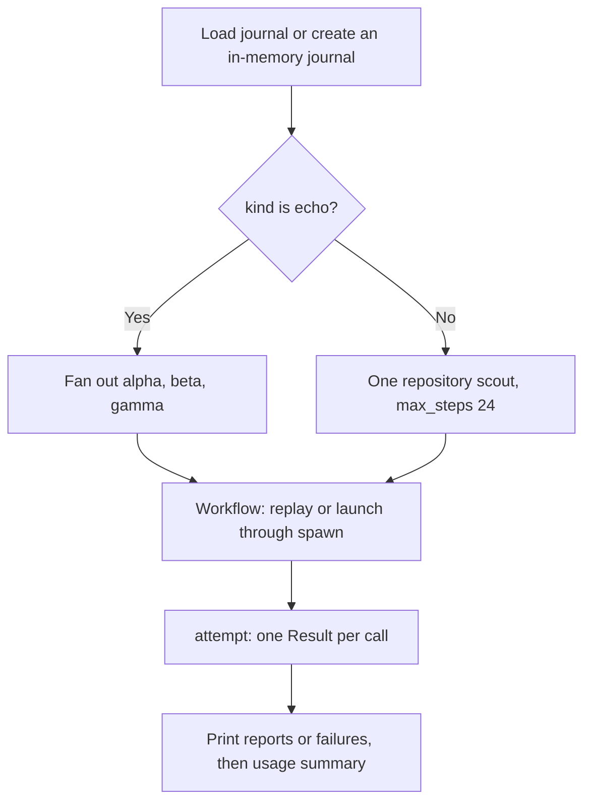

# moonbitlang/workflow/examples/scout

A small executable showing how to connect a workflow to an external engine,
fan out calls, handle typed failures, and replay a journal. It supports native
and wasm and exports no library API. Read [`main.mbt`](main.mbt) as a complete
example of [`workflow`](../../README.mbt.md) with
[`spawn`](../../spawn/README.mbt.md).

## Run the keyless probe

From the repository root, give it an executable that accepts
`subrun <kind>` and speaks the [child contract](../../docs/child-contract.md).
For example, with OpenSeek installed:

```sh
moon run examples/scout -- /absolute/path/to/openseek --journal scout.jsonl
moon run examples/scout -- /absolute/path/to/openseek --journal scout.jsonl
```

The first run launches three `echo` children for `alpha`, `beta`, and
`gamma`. The second run serves their successful reports from the same
journal. Its final summary should show zero new children, three replays,
and zero fresh tokens. Failures other than `Skipped` are attempted again.

The published form is:

```sh
moonx moonbitlang/workflow/examples/scout /absolute/path/to/openseek --journal scout.jsonl
```

The engine is external: this example does not install or build it. Although
the transport is engine-independent, the example's argv builder assumes
the OpenSeek-style `subrun` command and flags. It cannot point directly at
the Claude or Codex shim; use their documented `LaunchSpec` instead.

## Run a model-backed scout

```sh
moon run examples/scout -- /absolute/path/to/openseek --kind explore --journal explore.jsonl
```

Any non-`echo` kind takes the single-scout path. Its prompt asks where
`openseek subrun` dispatches kinds, with a hint to `cmd/openseek/subrun.mbt`
and a step request of 24. Run it with the intended source tree as the
engine's working directory; the published command can be invoked from that
tree. The engine inherits the working directory and provider credentials
from the environment. Model-backed calls may incur usage charges.

| Argument | Default and behavior |
| --- | --- |
| `engine` | Required executable path or name. |
| `--journal PATH` | Optional persistent journal; otherwise in memory. |
| `--kind KIND` | `echo`; only this kind fans out the three keyless probes. |
| `--model NAME` | Optional `--model` flag passed to the engine. |

The launcher forwards `kind`, any `max_steps`, and the chosen model as argv
in addition to the contract request envelope. It uses the runner's default
10-minute deadline, workflow concurrency 4, and a maximum of 16 live calls.
Those settings are in source, not command-line options.

## Execution and output



Launches print `▶ label`; replay hits print `↺ label (replayed)`. Each result
prints a `report:` JSON value or `FAILED:` message. The final line reports
live calls, replay count, and fresh token usage. A typed agent failure is
printed and does not by itself crash the example; cancellation and
infrastructure errors still propagate. Do not use a successful process exit
alone as proof that every agent returned a report.

Only calls and outcomes are durable, not arbitrary program side effects.
The example uses an empty replay scope and does not include the model or
working tree revision in its call identity. Use a new journal when changing
those settings, or add an appropriate `replay_scope` when adapting the code.

Render its journal with:

```sh
moon run viz -- scout.jsonl scout.html
```

See [`viz`](../../viz/README.mbt.md) for what the report can infer from
completed calls.

## Development and related examples

```sh
moon run examples/scout --target native -- --help
moon check examples/scout --target native
moon check examples/scout --target wasm
```

This directory is a normal package and uses the local module when run from
the repository. The adjacent `.mbtx` scripts, including
[`simplify.mbtx`](../simplify.mbtx) and [`compose.mbtx`](../compose.mbtx),
instead bind the published module without a version pin. They are separate
programs: `moon test` does not compile them, and `moon check <script.mbtx>`
does not validate them. Use `moon run <script.mbtx>` to execute those
examples with their required engines and credentials.
