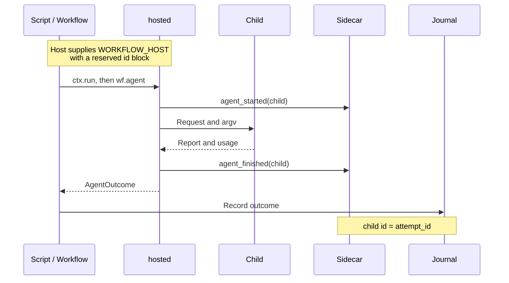

---
moonbit:
  import:
    - path: moonbitlang/core/env
      alias: env
---

# moonbitlang/workflow/hosted

Run a workflow using launch coordinates supplied by its host. The host
chooses the executable, child ids, launch capacity, and output paths; the
script supplies the workflow body. This package combines
[`workflow`](../README.mbt.md) and [`spawn`](../spawn/README.mbt.md) and
supports native and wasm.

Use it when an agent scripting tool, sandbox, or job controller launches
your script and needs to track the children it starts. For standalone
execution where your program chooses its own launch settings, use `spawn`.

## Read the handoff

After adding the module, import `moonbitlang/workflow/hosted` in your
`moon.pkg`; also import `moonbitlang/workflow` if you use its types or
combinators by name.

`context()` parses the `WORKFLOW_HOST` environment variable. It returns
`None` for an absent, malformed, incomplete, or unsupported handoff. If
hosting is required, treat `None` as a configuration error; if your program
also supports standalone execution, choose that path explicitly.

A `Context` comes only from that variable. The package deliberately exposes
no way to build one from JSON a script wrote itself, so the coordinates a
run uses are always the ones the host wrote down. This example supplies a
document the way a host does, then reads it back:

The examples emulate the host inside a test process and also import
`moonbitlang/core/env`. A hosted application normally just calls `context()`
to read its inherited configuration.

```mbt check
///|
test "read a host's launch coordinates" {
  let document : Json = {
    "v": 1,
    "exe": "/opt/engine",
    "child_args": ["subrun", "{kind}", "--session", "{child}"],
    "child_id": "run7-sr-{n}",
    "ids": [5, 32],
    "journal": "/store/run7.jsonl",
    "events": "/store/run7.events.jsonl",
  }
  @env.set_env_var("WORKFLOW_HOST", document.stringify())
  defer @env.unset_env_var("WORKFLOW_HOST")
  guard @hosted.context() is Some(ctx) else {
    fail("expected a complete handoff")
  }
  assert_eq(ctx.child_capacity(), 32)
  assert_eq(ctx.journal_path(), Some("/store/run7.jsonl"))
  assert_eq(ctx.events_path(), Some("/store/run7.events.jsonl"))
}

///|
test "an incomplete or unknown handoff reads as no handoff" {
  @env.set_env_var("WORKFLOW_HOST", "{\"v\":2}")
  defer @env.unset_env_var("WORKFLOW_HOST")
  assert_true(@hosted.context() is None)
}
```

| Field | Required | Meaning |
| --- | --- | --- |
| `v` | Yes | Handoff version, currently 1. |
| `exe` | Yes | Nonempty executable path or name. |
| `child_args` | Yes | Nonempty array of argv strings; substitutes `{kind}` and `{child}` in each token. |
| `child_id` | Yes | Template containing `{n}`, replaced by the reserved ordinal. |
| `ids` | Yes | `[first, count]`, both positive; supply whole-number ordinals and counts. |
| `journal` | No | Append-only journal path; omitted uses an in-memory journal. |
| `events` | No | Sidecar JSONL path; omitted disables file-based sidecar output. |
| `cwd` | No | Child working directory; omitted inherits the current directory. |
| `deadline_ms` | No | Per-child wall deadline; default 600,000 ms. |

The example reserves ordinals 5 through 36. Reading checks the document's
structure; it does not check executable availability, create output
directories, or verify permissions. The full host/child agreement is in
[the host handoff](../docs/host-handoff.md).

## Run a workflow

`ctx.run(body, max_concurrent=4)` loads the journal, creates one runner and
workflow, and returns the body's result. It propagates errors. The optional
concurrency setting controls simultaneous calls; the reserved block bounds
the number of children the runner can allocate.

This checked example uses `sh` as a local engine and needs no credentials:

```mbt check
///|
async test "run within a one-child reservation" {
  let child =
    #|read request
    #|printf '%s\n' '{"subrun_report":{"answer":"ready"}}'
  let document : Json = {
    "v": 1,
    "exe": "sh",
    "child_args": ["-c", child],
    "child_id": "demo-{n}",
    "ids": [1, 1],
  }
  @env.set_env_var("WORKFLOW_HOST", document.stringify())
  defer @env.unset_env_var("WORKFLOW_HOST")
  guard @hosted.context() is Some(ctx) else {
    fail("expected a complete handoff")
  }
  let answer = ctx.run(wf => {
    wf.phase("probe")
    wf.agent(prompt="Are you ready?", kind="echo", label="probe:one")
  })
  assert_eq(answer, { "answer": "ready" })
}
```

## How a host follows the run



The sidecar reports launches immediately. The journal records outcomes only
after calls resolve. These are distinct from the core's in-process
`WorkflowEvent` callbacks. A normal sidecar pair looks like:

```json
{"event":"agent_started","child":"run7-sr-5","kind":"explore","label":"survey:api"}
{"event":"agent_finished","child":"run7-sr-5","status":"captured","steps":4,"tokens":120}
```

Finish statuses include `captured`, `no_report`, `max_steps`, `context_yield`,
`timed_out`, `failed`, and `cancelled`. On caller cancellation, the runner
tears down the child, attempts a finish event with observed usage under
cancellation protection, and re-raises. No cancelled outcome is journalled.
The default sidecar writer is best effort; hard termination or a write
failure can leave an incomplete pair.

A replay uses the prior journal entry without allocating a new child or
writing a sidecar pair. Past the reserved capacity, the runner returns
`DidNotFinish(Skipped, attempt=None)` without spawning or writing a pair;
`Workflow` surfaces this as `AgentFailed`.

## Host responsibilities and advanced use

Allocate disjoint id blocks, including across resumed runs and the host's
own children. Use one `ctx.run` or one `ctx.runner()` for each reservation:
every new runner starts its own counter at `first`, so reusing a context to
create multiple runners can reuse child ids. The handoff is an accounting
protocol, not an operating-system sandbox; process permissions and trust in
the supplied environment remain the host's responsibility.

Only `{kind}` and `{child}` are argv substitutions. `max_steps` and `schema`
travel in the request envelope; choose a child that honors those fields.
This package does not provision worker worktrees or integrate their changes.

Use `ctx.runner()` to assemble your own `Workflow` when you need options
such as `replay_scope`, `on_event`, or a replay policy implemented by a
wrapping runner. You must then attach the journal yourself. Its optional
`emit_line` callback replaces the sidecar writer; it receives the optional
path and JSON event. Keep it best effort if reporting failures should not
interrupt the workflow.

## Development

[`context.mbt`](context.mbt) parses the handoff;
[`runner.mbt`](runner.mbt) allocates ids and emits sidecar events;
[`run.mbt`](run.mbt) assembles the workflow.
[`hosted_wbtest.mbt`](hosted_wbtest.mbt) exercises child ids, capacity,
journals, and cancellation using local shell children;
[`hosted_test.mbt`](hosted_test.mbt) checks the public unhosted entry point.

```sh
moon test hosted --target native
moon test hosted --target wasm
```

Host-specific top-level fields are available through `ctx.extension(name)` as
`Json?`. For example, OpenSeek supplies audit input in an `openseek` object.
The library leaves extension schemas to the host; reserved handoff fields are
excluded. Missing fields return `None`, while explicit null is `Some(Null)`.
