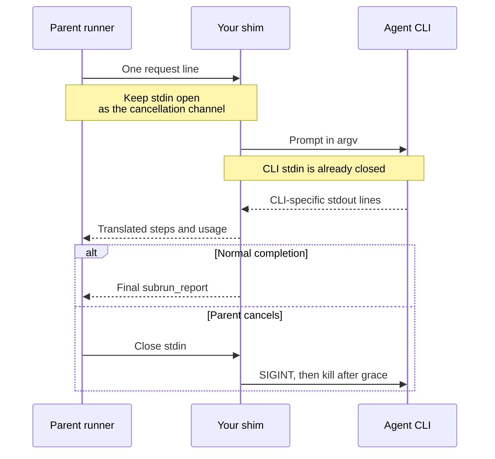

# moonbitlang/workflow/shim

Build a process adapter from an agent CLI to the workflow
[child contract](../docs/child-contract.md). This shared library parses the
parent's request, runs the CLI, watches for cancellation, and constructs
contract events. It supports native and wasm.

The dialect-specific work lives in the executables
[`shim/claude`](claude/README.mbt.md) and
[`shim/codex`](codex/README.mbt.md). Use those directly to run existing
engines; import `moonbitlang/workflow/shim` in `moon.pkg` when implementing
another adapter.

## Two different stdin streams



The CLI must not inherit the parent's cancellation pipe as its input.
`run_cli` gives it an already-closed stdin and delivers its prompt through
the argv supplied by the dialect. CLI stderr and environment are inherited.

## Parse requests and options

`read_request()` reads one line from stdin. `None` means EOF before a
request; `Some(Err(message))` means invalid input; `Some(Ok(request))` is
ready to run. `Request::parse` is the same parser without I/O:

```mbt check
///|
test "decode a v1 request and its prompt" {
  let line =
    #|{"workflow_contract":1,"id":"probe-1","kind":"explore","max_steps":8,"input":{"query":"Find the entry point","hints":"Look in src/"}}
  guard @shim.Request::parse(line) is Ok(request) else {
    fail("expected a valid request")
  }
  assert_eq(request.id, Some("probe-1"))
  assert_eq(request.kind, "explore")
  assert_eq(request.max_steps, Some(8))
  assert_eq(request.prompt, "Find the entry point\n\nHints: Look in src/")
  assert_true(@shim.Request::parse("not JSON") is Err(_))
}
```

The supported request is the v1 envelope with an `input`. It may carry an
id, kind (default `explore`), integer `max_steps`, and object-valued `schema`;
`schema: null` means absent. A present malformed step count or schema is an
error. A bare input is also accepted for manual use.

Input must yield a nonblank prompt: a string, `{query, hints?}`, or
`{prompt}`. `Request` preserves both the original `input` and the derived
`prompt`. An arbitrary object such as `{task: ...}` is not automatically
translated, even when `kind` is `worker`.

`Options::parse` takes argv without the executable name and a default CLI
command. Both shipped dialects use these options:

| Option | Parsed value |
| --- | --- |
| `--command EXE` | CLI executable; defaults to the dialect's command name. |
| `--model NAME` | Model name forwarded by the dialect. |
| `--cwd DIR` | Child working directory. |
| `--writable` | Request a write-capable run; default false. |
| `--schema FILE` | Default schema file when the envelope supplies no schema. |
| `-- ARGS...` | Remaining arguments passed through unchanged. |

Unknown options are refused. Parse errors return display-ready `Err` text;
the shipped executables encode these errors as `command_error` JSONL events.
`--help` is handled by the argument parser and prints plain-text help before
any request is read.

```mbt check
///|
test "separate shim options from CLI passthrough" {
  guard @shim.Options::parse(
      ["--model", "example-model", "--", "--vendor-flag"],
      default_command="my-agent",
    )
    is Ok(options) else {
    fail("expected valid options")
  }
  assert_eq(options.command, "my-agent")
  assert_eq(options.model, Some("example-model"))
  assert_eq(options.extra, ["--vendor-flag"])
  assert_false(options.writable)
}
```

`Request(...)` and `Options(...)` constructors are useful for dialect tests.
They construct values directly and do not perform the parsers' validation.

## Emit the contract vocabulary

`emit(Json)` writes one JSON line. Use these helpers for events:

| Helper | Meaning |
| --- | --- |
| `agent_step(n)` | Current step index; the parent keeps the maximum. |
| `usage(...)` | A usage delta with all five required counters; optional price. |
| `max_steps_exhausted()` | The shim's step ceiling ended the run. |
| `turn_failed(reason)` | Execution failed without a usable report. |
| `command_error(reason)` | Invalid request, configuration, or launch. |
| `emit_report(value)` | Writes the final `{subrun_report: value}` line. |

`usage` derives `total_tokens` from prompt and completion counts. The parent
sums usage events, so an adapter must convert snapshots into deltas or emit
one settled total; forwarding both snapshots and totals double-counts cost.
`integral(Double)` rejects fractional or unrepresentable `Int` counters.

```mbt check
///|
test "construct a complete usage event" {
  assert_eq(
    @shim.usage(
      prompt_tokens=10,
      completion_tokens=4,
      cache_hit=6,
      cache_miss=4,
    ),
    {
      "event": "usage",
      "usage": {
        "prompt_tokens": 10,
        "completion_tokens": 4,
        "total_tokens": 14,
        "prompt_cache_hit_tokens": 6,
        "prompt_cache_miss_tokens": 4,
      },
    },
  )
}
```

## Run and classify the CLI

`run_cli(command~, args~, observe~, cwd?)` calls the async `observe` callback
for each stdout line. The callback emits translated events and returns
`Continue` or `Stop`. Keep diagnostics off the shim's stdout except as
contract events.

| `CliExit` | Adapter action |
| --- | --- |
| `Exited(code)` | Inspect dialect state for a report or failure; classify a nonzero exit without a report. |
| `Stopped` | The observer requested a stop, usually a step ceiling; emit its terminal event. |
| `Cancelled` | Parent stdin reached EOF; return without a report. |
| `Failed(reason)` | Launch or stream handling failed; emit a failure event. |

`Stop` signals the CLI with SIGINT by default and continues observing stdout
for up to `stop_grace_ms=3_000`, allowing late usage to arrive. The CLI is
then terminated if necessary. Parent EOF also initiates teardown. Async
cancellation of `run_cli` itself re-raises after cleanup instead of becoming
`CliExit.Cancelled`. A normal stdout close has a bounded 2-second exit wait.
Use `watch_stdin=false` only when there is no parent cancellation pipe, such
as a test. `stop_signal` can override SIGINT.

A dialect's usual sequence is: parse options and request, resolve schema,
build argv, run and observe, settle any deferred usage, then emit a terminal
event or one final report. Report wrapping, step definitions, tool policy,
and schema application belong to the dialect.

## Development

[`shim.mbt`](shim.mbt) contains framing and process lifetime;
[`options.mbt`](options.mbt) handles shared flags;
[`shim_test.mbt`](shim_test.mbt) checks parsers and process teardown. Keep
recorded CLI output fixtures and their dialect classifier changes together.

```sh
moon test shim --target native
moon test shim --target wasm
```
