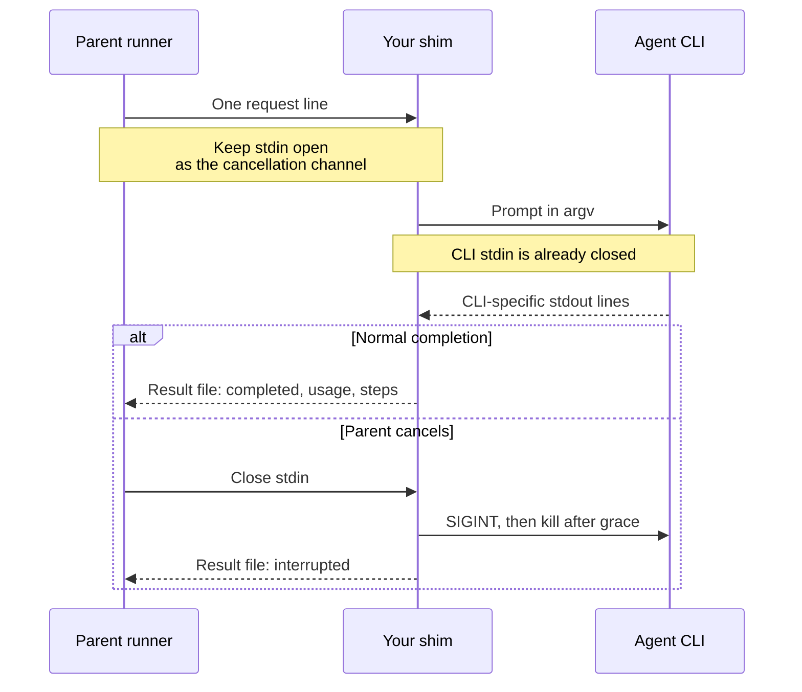

# moonbitlang/workflow/shim

Build a process adapter from an agent CLI to the workflow
[child contract](../docs/child-contract.md): one request line on stdin, one result file out. This shared library parses the
parent's request, runs the CLI, watches for cancellation, and writes the
result file atomically. It supports native and wasm.

The dialect-specific work lives in the executables
[`shim/claude`](claude/README.mbt.md) and
[`shim/codex`](codex/README.mbt.md). Use those directly to run existing
engines; import `moonbitlang/workflow/shim` in `moon.pkg` when implementing
another adapter.

## Two different stdin streams


```mermaid
sequenceDiagram
  participant P as Parent runner
  participant S as Your shim
  participant C as Agent CLI
  P->>S: One request line
  Note over P,S: Keep stdin open<br/>as the cancellation channel
  S->>C: Prompt in argv
  Note over S,C: CLI stdin is already closed
  C-->>S: CLI-specific stdout lines
  alt Normal completion
    S-->>P: Result file: completed, usage, steps
  else Parent cancels
    P->>S: Close stdin
    S->>C: SIGINT, then kill after grace
    S-->>P: Result file: interrupted
  end
```

The CLI must not inherit the parent's cancellation pipe as its input.
`run_cli` gives it an already-closed stdin and delivers its prompt through
the argv supplied by the dialect. CLI stderr and environment are inherited.
The shim's own stdout carries nothing: the runner drains it unread.

## A shim is `serve` plus a dialect

`serve(default_command~, run~)` is a whole shim's `main`. It parses argv
into `Options`, reads the request line from stdin into a `Request`, calls
`run` with both, and writes the `ShimResult` that `run` returns to the
`--result-file` path:

```moonbit nocheck
///|
async fn main {
  @shim.serve(default_command="my-agent", run=(options, request) => {
    let exit = @shim.run_cli(
      command=options.command,
      args=["--prompt", request.prompt],
      observe=_ => @shim.Continue,
    )
    match exit {
      Exited(0) => @shim.ShimResult(NoReport, steps=0)
      Exited(code) => @shim.ShimResult(Failed("exited \{code}"))
      Stopped => @shim.ShimResult(MaxStepsExhausted)
      Cancelled => @shim.ShimResult(Interrupted("the parent closed stdin"))
      Failed(reason) => @shim.ShimResult(Failed(reason))
    }
  })
}
```

Every ending the shim controls writes a result. An error `run` raises
becomes a `failed` result, and so does a request that cannot be parsed but
names its `request_id`. When there is nothing to answer — argv without a
result path, stdin closed before a request, or a malformed request whose id
is unknown — `serve` raises instead: let the error escape `main`, which
prints it on stderr and exits nonzero, and the runner reports that the
child left no result. The exit status is otherwise 0: the result file, not
the status, says how the run ended.

The file is written once, to a uniquely named sibling created exclusively,
then renamed over the path, so a reader sees either no file or a whole
one.

## Requests and options

`serve` accepts the version 1 request document of
[contract §2](../docs/child-contract.md#2-the-request-line) and hands
`run` a `Request`:

```json
{"version":1,"request_id":"probe-1","kind":"explore","limits":{"max_steps":8},"input":{"query":"Find the entry point","hints":"Look in src/"}}
```

`version` must be 1; `request_id` (echoed in the result) and `kind` are
required strings; `input` is required; `limits.max_steps` (an integer of at
least 1) and an object-valued `schema` (`null` means absent) are optional.
A present malformed ceiling or schema is refused, never read as absent.

The input must yield a nonblank prompt: a string, `{query, hints?}`, or
`{prompt}`. For the request above, `request.prompt` is
`"Find the entry point\n\nHints: Look in src/"`, `request.max_steps` is
`Some(8)`, and `request.input` keeps the original object. An arbitrary
object such as `{task: ...}` is not automatically translated, even when
`kind` is `worker`.

Both shipped dialects take these options:

| Option | Parsed value |
| --- | --- |
| `--result-file PATH` | Required. Where the result file goes; a launch passes `{result_file}`. |
| `--command EXE` | CLI executable; defaults to the dialect's command name. |
| `--model NAME` | Model name forwarded by the dialect. |
| `--cwd DIR` | Child working directory. |
| `--writable` | Request a write-capable run; default false. |
| `--schema FILE` | Default schema file when the request supplies no schema. |
| `-- ARGS...` | Remaining arguments passed through unchanged, in `options.extra`. |

Unknown options are refused, and so is argv without `--result-file`; the
problem goes to stderr and the shim exits nonzero. `--help` prints
plain-text help before any request is read.

`Request(...)` and `Options(...)` build values directly, for dialect tests;
they do not validate.

## Report the result

A dialect returns a `ShimResult(status, usage?, steps?)`:

| `Status` | Result `status` | Meaning |
| --- | --- | --- |
| `Completed(report)` | `completed` | The CLI finished; `report` is the result's `output`. |
| `NoReport` | `no_report` | The CLI exited cleanly without an answer. |
| `MaxStepsExhausted` | `max_steps_exhausted` | The step ceiling stopped the run. |
| `Interrupted(reason)` | `interrupted` | The parent closed stdin. |
| `Failed(reason)` | `failed` | The run could not finish. |

`usage` is a `Usage` with the prompt, completion, cache-hit, and cache-miss
token counts (`total_tokens` is derived) and an optional `cost_usd` when
the CLI states its own price. Omit it when the CLI reported nothing: the
result then carries no `usage`, and the parent records the spend as
unaccounted rather than free. `Usage::add` sums two readings. `steps` is
the dialect's own step count.

```mbt check
///|
test "a completed result document" {
  let usage = @shim.Usage(
    prompt_tokens=10,
    completion_tokens=4,
    cache_hit_tokens=6,
    cache_miss_tokens=4,
  )
  assert_eq(
    @shim.ShimResult(Completed({ "answer": "ok" }), usage~, steps=1).to_json(
      request_id="probe-1",
    ),
    {
      "version": 1,
      "request_id": "probe-1",
      "status": "completed",
      "output": { "answer": "ok" },
      "usage": {
        "prompt_tokens": 10,
        "completion_tokens": 4,
        "total_tokens": 14,
        "prompt_cache_hit_tokens": 6,
        "prompt_cache_miss_tokens": 4,
      },
      "steps": 1,
    },
  )
}
```

`integral(Double)` rejects fractional or unrepresentable `Int` counters
when a dialect reads its CLI's numbers.

## Run and classify the CLI

`run_cli(command~, args~, observe~, cwd?)` calls the async `observe` callback
for each stdout line. The callback updates the dialect's state and returns
`Continue` or `Stop`.

| `CliExit` | Adapter action |
| --- | --- |
| `Exited(code)` | Inspect dialect state for a report or failure; a nonzero exit without a report is `Failed`. |
| `Stopped` | The observer requested a stop, usually a step ceiling: `MaxStepsExhausted`. |
| `Cancelled` | Parent stdin reached EOF: `Interrupted`. |
| `Failed(reason)` | Launch or stream handling failed: `Failed`. |

`Stop`, and the parent's cancel, signal the CLI with SIGINT by default and
continue observing stdout for up to `stop_grace_ms=3_000`, allowing late
usage to arrive. The CLI is then terminated if necessary. Async
cancellation of `run_cli` itself re-raises after cleanup instead of
becoming `CliExit.Cancelled`. A normal stdout close has a bounded 2-second
exit wait. `until_cancelled` replaces the stdin-EOF cancel signal, for a
test whose stdin is not a parent's pipe; `stop_signal` can override SIGINT.

A dialect's usual `run` is: resolve the schema, build argv, run and
observe, then return the status its state implies with the usage and steps
it counted. Report wrapping, step definitions, tool policy, and schema
application belong to the dialect.

## Development

[`serve.mbt`](serve.mbt) is the shim's main loop;
[`request.mbt`](request.mbt) parses the request (and
[`options.mbt`](options.mbt) the shim's argv);
[`result.mbt`](result.mbt) builds and writes the result file;
[`shim.mbt`](shim.mbt) runs the CLI.
[`shim_test.mbt`](shim_test.mbt) checks the result document and process
teardown; [`shim_wbtest.mbt`](shim_wbtest.mbt) checks the parsers and
drives whole runs through a scripted `sh` dialect into a result file. Keep recorded CLI
output fixtures and their dialect classifier changes together.

```sh
moon test shim --target native
moon test shim --target wasm
```
