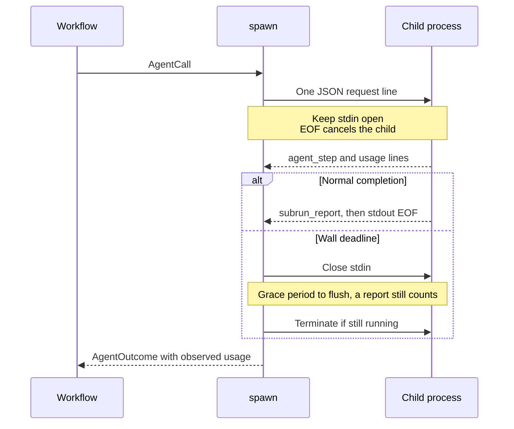

# moonbitlang/workflow/spawn

Run a child process as a workflow agent. This package owns the parent side
of the [child contract](../docs/child-contract.md): send one request, account
the child's streamed events, capture its report, and tear it down on timeout
or cancellation. It supports native and wasm.

Use `contract_runner` when building a workflow. Use `contract_run` when an
adapter needs the raw terminal, its own request id, live progress counters,
or access to parsed stdout lines. For a host-supplied launch configuration,
see [`hosted`](../hosted/README.mbt.md).

## Add a process runner

After `moon add moonbitlang/workflow`, import both packages in your `moon.pkg`:

```moonbit nocheck
import {
  "moonbitlang/workflow",
  "moonbitlang/workflow/spawn",
}

supported_targets = "native+wasm"
```

This checked example uses only `sh` and its builtins. It launches a real
child, accounts its usage, and returns its report without model credentials.

```mbt check
///|
async test "a shell child returns an accounted workflow report" {
  let child =
    #|read request
    #|printf '%s\n' '{"event":"agent_step","step":1}'
    #|printf '%s\n' '{"event":"usage","usage":{"prompt_tokens":7,"completion_tokens":3,"total_tokens":10,"prompt_cache_hit_tokens":0,"prompt_cache_miss_tokens":7}}'
    #|printf '%s\n' '{"subrun_report":{"answer":"ready"}}'
  let wf = @workflow.Workflow(
    runner=@spawn.contract_runner(launch=_ => {
      @spawn.LaunchSpec(command="sh", args=["-c", child])
    }),
    max_calls=1,
  )
  assert_eq(wf.agent(prompt="Are you ready?", kind="echo"), {
    "answer": "ready",
  })
  assert_eq(wf.calls_made(), 1)
  assert_eq(wf.tokens_spent(), 10)
}
```

`launch` runs once per live call and receives the entire `AgentCall`. It can
route by `kind`, choose an executable, or derive argv from the call. A replay
served by the workflow never invokes `launch`.

| `LaunchSpec` field | Behavior |
| --- | --- |
| `command`, `args` | Required executable and argument array. Arguments are passed directly, without shell expansion. |
| `cwd` | Child working directory; omitted means inherited. |
| `extra_env` | Overrides or adds to the inherited environment. |
| `deadline_ms` | Overrides the runner's deadline for this launch. |

The runner default is `deadline_ms=600_000` (10 minutes). Credentials belong
in the environment. A CLI that does not speak the contract needs an adapter,
such as [`shim/claude`](../shim/claude/README.mbt.md) or
[`shim/codex`](../shim/codex/README.mbt.md).

## Request and lifetime



The request includes `workflow_contract: 1`, `id`, `kind`, `input`, and
optional `max_steps` and `schema`. Engine options remain in argv. `max_steps`
is forwarded for the child to enforce; this runner enforces elapsed time.
Never make a child wait for stdin EOF before processing the request: EOF is
the cancellation signal. Diagnostics may go to stderr, which is inherited.

The deadline includes writing the request as well as reading stdout. On a
deadline, stdin closes and the child gets 5 seconds of grace by default.
Normal stdout EOF is followed by a bounded, 2-second exit-status wait.
These teardown periods mean a deadline is not a strict bound on the total
duration of `contract_run`.

External cancellation follows a different path: teardown completes and the
cancellation is re-raised. It does not return `TimedOut` or another terminal.

## Terminal precedence and accounting

If multiple signals arrive, the first applicable row determines the result:

| Priority | `ContractTerminal` | Evidence |
| --- | --- | --- |
| 1 | `Captured` | A `subrun_report` line arrived, even during deadline grace. |
| 2 | `Failed(reason)` | A classified failure event, spawn/pipe error, or observed nonzero exit without a report. |
| 3 | `TimedOut` | The wall deadline expired without higher-priority evidence. |
| 4 | `MaxSteps` | `max_steps_exhausted` was emitted. |
| 5 | `ContextYield` | A valid `context_yield` event was emitted. |
| 6 | `NoReport` | The stream ended without any of these signals. |

`Captured` means a report arrived, not that its content passed validation;
even JSON `null` is a report. The workflow adapter maps it to `Finished` and
the other terminals to `DidNotFinish`, retaining observed usage in either
case. It assigns attempt ids `cr-1`, `cr-2`, and so on per runner instance;
these are not globally unique session ids.

Steps are the maximum integral `agent_step.step` seen. Token usage is the
sum of valid `usage` lines, each of which must supply all five integral
counters shown in the example. An invalid counter or an invalid optional
`cost_usd` discards the whole usage line. Prices are summed only when
reported; absent prices remain `None`. Blank and non-JSON lines are ignored.
The [contract](../docs/child-contract.md) specifies the full event shapes.

## Using the lower-level API

```mbt check
///|
async test "inspect a no-report terminal directly" {
  let progress = @spawn.ContractProgress()
  let result = @spawn.contract_run(
    command="sh",
    args=["-c", "read request; exit 0"],
    input={ "query": "probe" },
    kind="echo",
    id="probe-1",
    wall_deadline_ms=5_000,
    progress~,
  )
  assert_true(result.terminal is @spawn.NoReport)
  assert_eq(result.report, None)
  assert_eq(progress.steps, 0)
}
```

`contract_run` additionally accepts `cancel_grace_ms` (default 5,000),
`observe_line`, and `progress`. The synchronous `observe_line` callback sees
every successfully parsed JSON line before classification. Use a fresh
`ContractProgress()` for each call: its mutable counters are updated in
place and remain available if cancellation unwinds past the return value.

When reports refer to resources that can disappear, pass `validate_replay`
to `contract_runner`. Return `Serve(outcome)` after checking or refreshing
the resource, or `Rerun` to reject that journal candidate. The core owns
candidate selection; see [replay](../README.mbt.md#replay-crash-resume-and-pay-only-for-new-work).

## Development

[`contract.mbt`](contract.mbt) implements framing and process lifetime;
[`exports.mbt`](exports.mbt) defines the live progress API.
[`spawn_test.mbt`](spawn_test.mbt) covers scripted child processes, usage,
terminal precedence, deadlines, and cancellation.

From the repository root:

```sh
moon test spawn --target native
moon test spawn --target wasm
```
