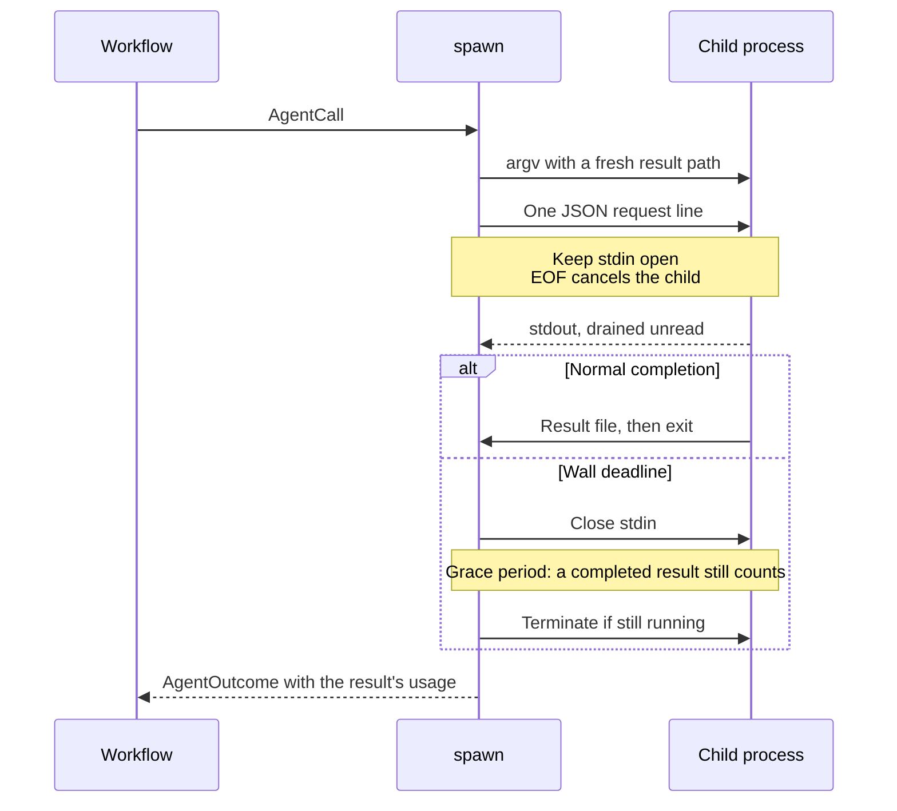

# moonbitlang/workflow/spawn

Run a child process as a workflow agent. This package owns the parent side
of the [child contract](../docs/child-contract.md): send one request, read
the one result file the child writes and account its usage, and tear it
down on timeout or cancellation. It supports native and wasm.

Every launch names `{result_file}` (`@spawn.ResultFilePlaceholder`) in the
child's argv; the runner replaces it with a fresh private path, and the
child writes its result there. The child's stdout is for humans and is
drained unread. OpenSeek's `openseek run` and this module's
[shims](../shim/README.mbt.md) speak the contract.

Use `contract_runner` when building a workflow. Use `contract_run` when an
adapter needs the raw terminal, its own request id, or the child's exit
status. For a host-supplied launch configuration, see
[`hosted`](../hosted/README.mbt.md).

## Add a process runner

After `moon add moonbitlang/workflow`, import both packages in your `moon.pkg`:

```moonbit nocheck
import {
  "moonbitlang/workflow",
  "moonbitlang/workflow/spawn",
}

supported_targets = "native+wasm"
```

This checked example uses only `sh` and its builtins. It launches a real
child, which echoes the request's id in the result file it writes; the
runner accounts its usage and returns its report without model credentials.

```mbt check
///|
async test "a shell child returns an accounted workflow report" {
  // `sh -c CHILD sh {result_file}`: the result path arrives as `$1`.
  let child =
    #|read request
    #|id=$(printf '%s' "$request" | sed 's/.*"request_id":"\([^"]*\)".*/\1/')
    #|printf '{"version":1,"request_id":"%s","status":"completed","output":{"answer":"ready"},"usage":{"prompt_tokens":7,"completion_tokens":3,"total_tokens":10,"prompt_cache_hit_tokens":0,"prompt_cache_miss_tokens":7},"steps":1}' "$id" > "$1"
  let wf = @workflow.Workflow(
    runner=@spawn.contract_runner(launch=_ => {
      @spawn.LaunchSpec(command="sh", args=[
        "-c",
        child,
        "sh",
        @spawn.ResultFilePlaceholder,
      ])
    }),
    max_calls=1,
  )
  assert_eq(wf.agent(prompt="Are you ready?", kind="echo"), {
    "answer": "ready",
  })
  assert_eq(wf.calls_made(), 1)
  assert_eq(wf.tokens_spent(), 10)
}
```

`launch` runs once per live call and receives the entire `AgentCall`. It can
route by `kind`, choose an executable, or derive argv from the call. A replay
served by the workflow never invokes `launch`.

| `LaunchSpec` field | Behavior |
| --- | --- |
| `command`, `args` | Required executable and argument array. Arguments are passed directly, without shell expansion. `args` must name `{result_file}`; a launch that does not is a `Failed` terminal, and nothing is spawned. |
| `cwd` | Child working directory; omitted means inherited. |
| `extra_env` | Overrides or adds to the inherited environment. |
| `deadline_ms` | Overrides the runner's deadline for this launch. |

The runner default is `deadline_ms=600_000` (10 minutes). Credentials belong
in the environment. A CLI that does not speak the contract needs an adapter,
such as [`shim/claude`](../shim/claude/README.mbt.md) or
[`shim/codex`](../shim/codex/README.mbt.md).

For example, OpenSeek's presets, one `openseek run` child per call:

```moonbit nocheck
///|
let runner : @workflow.Runner = @spawn.contract_runner(launch=call => {
  @spawn.LaunchSpec(command="openseek", args=[
    "run",
    "--input-format",
    "json",
    "--cancel-on-stdin-eof",
    "--kind",
    call.kind,
    "--result-file",
    @spawn.ResultFilePlaceholder,
  ])
})
```

The request carries the kind, the input, and `limits.max_steps`; argv holds
only engine settings (OpenSeek also checks `--kind` against the request).

## Request and lifetime


```mermaid
sequenceDiagram
  participant W as Workflow
  participant R as spawn
  participant C as Child process
  W->>R: AgentCall
  R->>C: argv with a fresh result path
  R->>C: One JSON request line
  Note over R,C: Keep stdin open<br/>EOF cancels the child
  C-->>R: stdout, drained unread
  alt Normal completion
    C->>R: Result file, then exit
  else Wall deadline
    R->>C: Close stdin
    Note over R,C: Grace period: a completed result still counts
    R->>C: Terminate if still running
  end
  R-->>W: AgentOutcome with the result's usage
```

The runner creates a private directory per launch, substitutes its
`result.json` for `{result_file}`, and writes one request line on stdin:
`{"version": 1, "request_id", "kind", "input", "limits"?: {"max_steps"},
"schema"?}`. Engine options remain in argv; `limits.max_steps` is for the
child to enforce, and this runner enforces elapsed time. Never make a child
wait for stdin EOF before processing the request: EOF is the cancellation
signal. Diagnostics may go to stderr, which is inherited.

The deadline includes writing the request as well as draining stdout. On a
deadline, stdin closes and the child gets 5 seconds of grace by default.
Normal stdout EOF is followed by a bounded, 2-second exit-status wait.
These teardown periods mean a deadline is not a strict bound on the total
duration of `contract_run`. The private directory is removed afterwards.

External cancellation follows a different path: teardown completes and the
cancellation is re-raised. It does not return `TimedOut` or another terminal.

## The result and its terminal

When the child is done, its result file is the whole account: `status`
(`completed` with `output`, `no_report`, `max_steps_exhausted`, or
`context_yield` / `aborted` / `interrupted` / `failed` with a `reason`), and
optionally `usage` (the five counters, plus `cost_usd` when the engine
prices its work) and `steps`. A result must echo the request's
`request_id`.

| Evidence | `ContractTerminal` |
| --- | --- |
| The argv names no `{result_file}`, or pipes, spawn, or the private directory failed | `Failed(reason)` |
| `completed`, even in the deadline's grace window | `Captured`, with the `output` as the report |
| The deadline elapsed, and there is no `completed` result | `TimedOut` |
| `no_report` / `max_steps_exhausted` / `context_yield` | `NoReport` / `MaxSteps` / `ContextYield` |
| `aborted` / `interrupted` / `failed` | `Failed(reason)` |
| No file, an unreadable or malformed one, another request's, or an unknown status | `Failed(reason)` |

A missing file never means success. `Captured` means a result arrived, not
that its content passed validation; even JSON `null` is a report. The
workflow adapter maps `Captured` to `Finished` and the other terminals to
`DidNotFinish`, retaining the result's usage in either case. It assigns
attempt ids `cr-1`, `cr-2`, and so on per runner instance; these are the
requests' `request_id`s, not globally unique session ids.

Nothing is observed while the child runs, so the counters are the result's
`usage` and `steps`. When there is no account from the child (no file, a
malformed file, or a result without `usage`), `ContractResult.unaccounted`
says why; a failure before any child started spent nothing and is not
unaccounted. `ContractResult.exit_code` keeps the exit status beside the
result: a `completed` result with a nonzero exit is still `Captured`.

## Using the lower-level API

```mbt check
///|
async test "inspect a no-report terminal directly" {
  let result = @spawn.contract_run(
    command="sh",
    args=[
      "-c",
      "read request; printf '{\"version\":1,\"request_id\":\"probe-1\",\"status\":\"no_report\"}' > \"$1\"",
      "sh",
      @spawn.ResultFilePlaceholder,
    ],
    input={ "query": "probe" },
    kind="echo",
    id="probe-1",
    wall_deadline_ms=5_000,
  )
  assert_true(result.terminal is @spawn.NoReport)
  assert_eq(result.report, None)
  assert_eq(result.unaccounted, Some("the child's result carries no usage"))
  assert_eq(result.exit_code, Some(0))
}
```

`contract_run` additionally accepts `cancel_grace_ms` (default 5,000).

When reports refer to resources that can disappear, pass `validate_replay`
to `contract_runner`. Return `Serve(outcome)` after checking or refreshing
the resource, or `Rerun` to reject that journal candidate. The core owns
candidate selection; see [replay](../README.mbt.md#replay-crash-resume-and-pay-only-for-new-work).

## Development

[`contract.mbt`](contract.mbt) implements the request, the result file, and
process lifetime. [`spawn_test.mbt`](spawn_test.mbt) covers scripted child
processes, result classification, usage, deadlines, and cancellation.

From the repository root:

```sh
moon test spawn --target native
moon test spawn --target wasm
```
