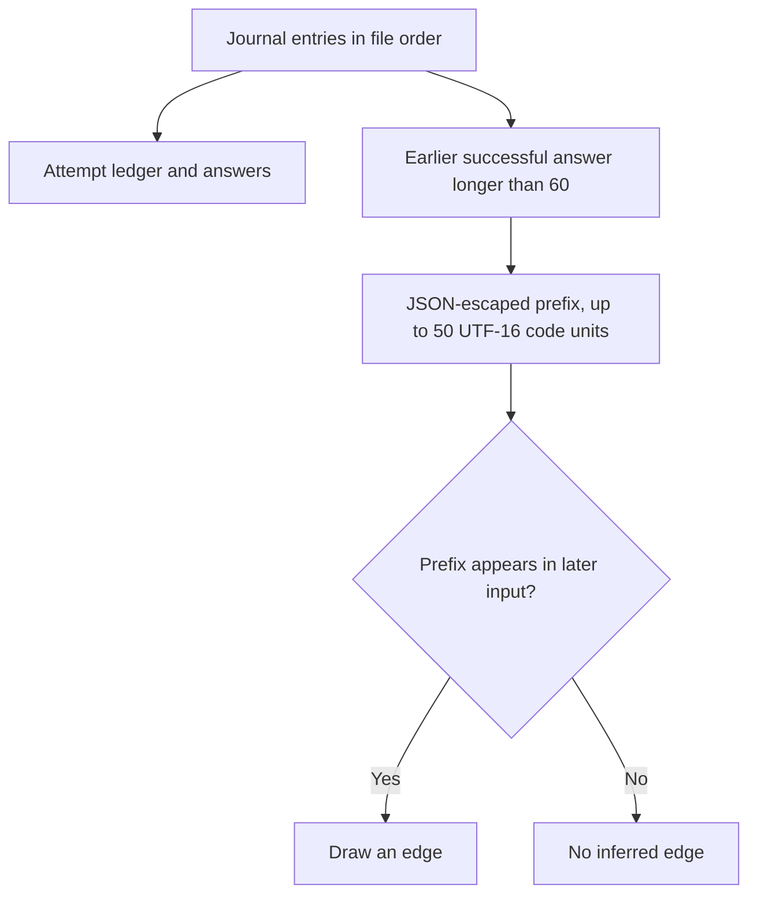

# moonbitlang/workflow/viz

Turn a workflow journal into a self-contained HTML report with an attempt
ledger, expandable answers, and a graph of possible data dependencies.
This is an executable for native and wasm, with no importable API. It needs
a journal file, not access to the engines that produced it.

## Render a journal

From this repository's root:

```sh
moon run viz -- run.jsonl
moon run viz -- run.jsonl report.html
```

Or run the published executable from a directory containing your journal:

```sh
moonx moonbitlang/workflow/viz run.jsonl report.html
```

| Argument | Meaning |
| --- | --- |
| `journal` | Required input path. |
| `out` | Optional output path; default is `<journal>.html`. |
| `--watch` | Re-read and render every 2 seconds; generated HTML refreshes every 2 seconds. |

The tool writes or replaces the output file. Choose an output path distinct
from the journal. Its parent directory must exist. Open the HTML file in a
browser; the page has inline CSS and SVG and needs no server or external
assets. `just viz run.jsonl report.html` is a repository shortcut.

To follow a running workflow:

```sh
moon run viz -- run.jsonl report.html --watch
```

Stop the command when finished following the run. Render once without
`--watch` to remove the page's automatic refresh before sharing a snapshot.
The page contains report text, so share it with the same audience as the
underlying journal.

## What the report shows

Each journal entry becomes a row with its label, phase, `Finished` or
`DidNotFinish` status, step count, elapsed milliseconds, and token usage.
Failures with an attempt contribute their usage just like successes.
Elapsed time is blank when the entry lacks timestamps. Expand a row's
answer panel to read its output or failure reason; the newest panel starts
open. Text is HTML-escaped.

Rows follow journal file order, normally completion order. They include
historical attempts across resume generations. Replay hits do not append
entries, so they do not add rows; an agent currently running has no row
until its outcome is journalled. To observe launches as they happen, use
[`hosted` sidecar events](../hosted/README.mbt.md#how-a-host-follows-the-run)
or the core's event callback.

## How the graph is derived



For a successful report, the probe text is its `answer` field when that field
is a string; otherwise it is the whole report serialized as JSON. For each
answer longer than 60 UTF-16 code units,
the renderer takes a surrogate-safe prefix of up to 50, JSON-escapes it,
and looks for it in each later entry's serialized input.

An edge is a content-match heuristic, not a declared dependency or proof of
causality. Repeated boilerplate can create an edge; short, summarized, or
transformed answers can hide one. Entries without matching text still appear
as graph nodes. There is no recorded static DAG to recover.

## Reading a live file

The parser accepts `{"v":1,"e":...}` entries and skips blank, malformed,
metadata, and unsupported lines. It reads without modifying the journal;
it deliberately does not use `Journal::load`, which can repair a torn tail.
That makes it suitable for watching an append in progress, but not for
auditing journal integrity.

A missing, unreadable, or empty journal is treated as having no entries. If
none can be parsed, the tool prints a message and leaves any existing HTML
unchanged. In watch mode, render failures are printed and retried on the
next tick. Errors are reported as text rather than a guaranteed nonzero
process status; automation should check that the expected output exists.

## Development

[`main.mbt`](main.mbt) contains argument parsing, the tolerant journal
reader, edge inference, and HTML rendering. From the repository root:

```sh
moon run viz --target native -- --help
moon check viz --target native
moon check viz --target wasm
```

For a report with known local data, run the keyless
[`examples/scout`](../examples/scout/README.mbt.md) example with a journal,
then render that journal here.
